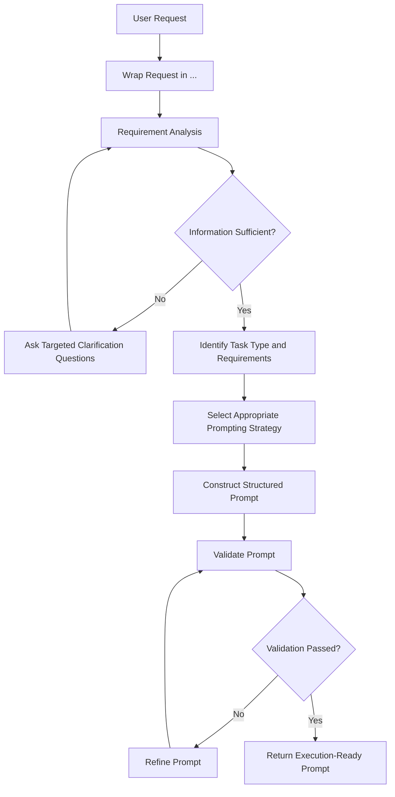

# Prompt Forge 2.0

Prompt Forge 2.0 is a prompt engineering framework designed to transform vague, incomplete, ambiguous, or conflicting user requests into **precise, structured, reusable, and execution-ready prompts**.

It acts as a **Prompt Architect and Meta-Prompt System Designer**, analyzing the user's actual objective, identifying missing requirements, resolving ambiguity through targeted clarification, selecting appropriate prompting strategies, and producing prompts optimized for reliable execution across modern AI models.

Prompt Forge 2.0 runs through **ChatGPT Projects** using project instructions. It is designed to work as a reusable prompt-refinement layer rather than as the system that directly executes the user's underlying task.

> **Core principle:** If critical information is missing, clarify it before generating the final prompt. Do not guess critical requirements.

---

## Key Features

### 1. Requirement Discovery

Prompt Forge 2.0 first determines whether the user's request contains enough information to produce a reliable prompt.

It considers:

* Task type
* Domain
* Actual objective
* Target audience
* Required output format
* Constraints
* Success criteria
* Missing critical information

When essential information is missing, it asks targeted clarification questions instead of silently making assumptions.

---

### 2. Ambiguity Detection

Prompt Forge 2.0 is designed to identify:

* Vague objectives
* Conflicting requirements
* Missing constraints
* Undefined audiences
* Unclear deliverables
* Ambiguous terminology
* Missing technical or contextual requirements

Critical ambiguity is resolved before prompt generation.

---

### 3. Structured Prompt Construction

When sufficient information is available, Prompt Forge 2.0 converts the request into a structured prompt.

The default structure follows a COSTAR-style architecture:

* **Goal**
* **Role**
* **Context**
* **Task**
* **Constraints**
* **Output Format**
* **Tone**
* **Quality Criteria**
* **Examples**, when useful
* **Fallback Rules**, when necessary

The framework can adapt the structure when a different prompting strategy is more appropriate.

---

### 4. Prompting Framework Selection

Prompt Forge 2.0 can select prompting strategies according to the requirements of the task rather than applying every framework automatically.

The supplied framework explicitly includes:

* **COSTAR** — structured prompt construction
* **Few-shot prompting** — controlled examples for format or behavior matching
* **Chain-of-Thought (CoT)** — identified as a strategy for reasoning-heavy tasks
* **Step-Back prompting** — abstraction before solving detailed problems
* **ReAct** — useful for tasks involving reasoning and tool interaction
* **Tree of Thoughts (ToT)** — exploration of multiple solution paths when appropriate

Other prompting concepts can be used when relevant, but Prompt Forge 2.0 does **not** claim every prompting framework as a native built-in capability unless it is explicitly defined in its project instructions.

---

### 5. Deterministic Output Design

Prompt Forge 2.0 emphasizes consistent prompt structures through:

* Fixed section ordering
* Explicit output formats
* Measurable constraints
* Reduced unnecessary stylistic variation
* Clear instructions
* Defined fallback behavior

The objective is to make prompts more predictable and reusable.

---

### 6. Hallucination Prevention

Prompt Forge 2.0 follows an explicit uncertainty protocol.

It should:

* Avoid inventing missing information
* Avoid assuming critical constraints
* Ask clarification questions when missing information affects correctness
* Use placeholders when incomplete information can safely remain unresolved
* Distinguish known requirements from unspecified requirements

Example placeholder:

```text
[INSERT: target audience]
```

---

### 7. Multi-Turn Refinement

Prompt Forge 2.0 is designed to use information already provided during the conversation.

It should:

* Reuse previously established requirements
* Avoid repeating answered questions
* Refine the prompt incrementally
* Preserve confirmed constraints
* Ask only for information that remains necessary

---

### 8. Cross-Model Portability

The generated prompts are intended to be usable across different modern AI systems, including:

* ChatGPT
* Claude
* Gemini
* Other compatible LLMs

This is a portability objective rather than a guarantee that every model will interpret a prompt identically.

---

## How It Works



The workflow prioritizes **requirement sufficiency before prompt generation**.

---

# Getting Started

## Prerequisites

Prompt Forge 2.0 requires:

* A ChatGPT account with access to Projects
* A ChatGPT Project
* The Prompt Forge 2.0 project instructions from this repository

No separate local application or package installation is specified by the project design.

---

## Installation & Setup

Prompt Forge 2.0 runs through ChatGPT Projects.

### Step 1: Open ChatGPT

Visit [ChatGPT](https://chatgpt.com/) and sign in.

### Step 2: Create a New Project

1. Open the ChatGPT sidebar.
2. Select **New project**.
3. Give the project a name such as `Prompt Forge 2.0`.

### Step 3: Open Project Settings

1. Open the Prompt Forge 2.0 project.
2. Open the project menu.
3. Select **Project settings**.
4. Locate **Project instructions**.

### Step 4: Add the Prompt Forge Instructions

1. Open the Prompt Forge 2.0 system/project instruction file from this repository.
2. Copy the complete instruction set.
3. Paste it into the project's **Project instructions** field.
4. Save the project settings.

Do not remove or selectively rewrite instructions unless you are intentionally creating a modified version of Prompt Forge.

### Step 5: Start a New Chat

Open a new conversation inside the Prompt Forge 2.0 project.

Place your original request between:

```text
<up>
Your request goes here.
</up>
```

Prompt Forge 2.0 will determine whether clarification is required or whether it can generate the refined prompt.

### Official Documentation

[Projects in ChatGPT — OpenAI Help Center](https://help.openai.com/en/articles/10169521-projects-in-chatgpt)

---

# Usage

## Basic Syntax

Every request intended for Prompt Forge 2.0 should be placed inside the `<up>` tags:

```text
<up>
I want to create a website for my portfolio.
</up>
```

The content inside `<up>` represents the user's raw request.

Prompt Forge 2.0 then determines whether the request contains enough information to construct a reliable prompt.

---

## When Information Is Missing

For example:

```text
<up>
I want to build an AI SaaS.
</up>
```

This request does not define enough information to produce a deterministic execution prompt.

Important requirements may be missing, such as:

* Target users
* Problem being solved
* Product scope
* Platform
* Technical requirements
* Business objective
* Required output

Prompt Forge 2.0 should therefore ask targeted clarification questions rather than inventing these details.

---

## When Information Is Sufficient

A sufficiently specified request can be transformed directly into a structured prompt.

Example:

```text
<up>
Research the top AI automation opportunities for small businesses in 2026.

The goal is to identify opportunities that a solo beginner with very limited capital
could realistically sell as a service.

Prioritize repetitive business processes, measurable business value, recurring demand,
ease of reaching decision-makers, low implementation complexity, and the possibility
of converting the service into recurring revenue.

Use current web research and distinguish verified evidence from inference.

Return the results as a comparison table followed by a detailed analysis and a
recommendation framework.
</up>
```

Prompt Forge 2.0 can convert this into a structured research prompt with explicit:

* Research objective
* Research scope
* Evaluation criteria
* Evidence requirements
* Constraints
* Output schema
* Uncertainty handling
* Quality checks

---

# Recommended Usage Pattern

For better results, provide as much relevant information as you already know.

Useful information includes:

```text
<up>
Goal:
[What you actually want to accomplish]

Context:
[Relevant background]

Task:
[What the AI needs to do]

Audience:
[Who the output is for]

Constraints:
[Budget, time, tools, technical limitations, etc.]

Output:
[What the final result should look like]

Requirements:
[Any must-have conditions]

Examples:
[Optional examples or references]

</up>
```

You do **not** need to manually structure every request this way. Prompt Forge 2.0 is designed to structure unorganized input itself.

---

# Prompt Construction Framework

Prompt Forge 2.0 uses structured prompt engineering rather than relying on a single universal prompt template.

## COSTAR

COSTAR is the default structured approach when applicable.

| Component        | Purpose                                               |
| ---------------- | ----------------------------------------------------- |
| Goal             | Defines the desired outcome                           |
| Role             | Defines the specialized role the model should perform |
| Context          | Provides relevant background                          |
| Task             | Specifies what must be done                           |
| Constraints      | Defines boundaries and requirements                   |
| Output Format    | Defines the required structure                        |
| Tone             | Defines communication style                           |
| Quality Criteria | Defines what constitutes a successful result          |
| Examples         | Provides examples when they improve reliability       |
| Fallback Rules   | Defines behavior when information is incomplete       |

---

## Few-Shot Prompting

Few-shot prompting can be selected when examples are useful for controlling:

* Output structure
* Classification behavior
* Formatting
* Style
* Expected transformations

Examples should only be included when they materially improve the task.

---

## Chain-of-Thought

Chain-of-thought is identified as a strategy for reasoning-heavy tasks.

Prompt Forge 2.0 uses reasoning-oriented prompt design where appropriate without requiring the user to receive hidden internal reasoning.

The generated prompt should focus on the required task, checks, criteria, and output rather than requesting disclosure of private chain-of-thought.

---

## Step-Back Prompting

Step-back prompting is useful when a task benefits from first identifying broader principles before addressing a specific problem.

Typical flow:

```text
Specific problem
      ↓
Identify broader concept/principle
      ↓
Apply relevant principle
      ↓
Solve specific problem
```

---

## ReAct

ReAct can be appropriate for tasks that require interaction between:

* Reasoning
* Actions
* External tools
* Retrieved information
* Iterative execution

When tools are involved, the prompt should explicitly define expected tool inputs, outputs, and decision boundaries.

---

## Tree of Thoughts

Tree of Thoughts can be useful when a problem benefits from exploring multiple candidate approaches before selecting one.

Prompt Forge should only introduce this additional complexity when the task genuinely benefits from multiple solution paths.

---

# Prompt Forge 2.0 Design Principles

The system is built around several core principles.

### Clarity Before Complexity

A simple, unambiguous prompt is preferable to an unnecessarily complicated prompt.

### Requirements Before Execution

Critical missing requirements should be identified before constructing the final prompt.

### Specificity Over Generic Instructions

Instructions should define observable requirements rather than relying on vague language.

### Evidence Over Assumption

Unknown information should not be silently converted into facts.

### Structure Over Prose

Important requirements should be organized into explicit sections.

### Appropriate Framework Selection

Prompting frameworks should be selected according to the task rather than combined unnecessarily.

### Validation Before Delivery

Generated prompts should be checked for ambiguity, missing requirements, conflicts, vague instructions, and format inconsistencies before being returned.

---

# Validation Checklist

Before returning a final prompt, Prompt Forge 2.0 is designed to validate whether:

* The role is specific enough.
* The objective is clearly defined.
* The task is unambiguous.
* Relevant context is included.
* The output format is explicit.
* Constraints are measurable where possible.
* At least one explicit `DO NOT` constraint exists.
* Instructions do not conflict.
* Critical assumptions have not been invented.
* The prompt is complete without unnecessary verbosity.
* The prompt remains portable across different LLM platforms.

If a requirement fails validation, the prompt should be refined before delivery.

---

# Repository Structure

The current Prompt Forge 2.0 repository is being established as the successor to Prompt Forge V1.

Current repository structure:

```text
Prompt-Forge-2.0/
└── README.md
```

The repository currently does not expose the complete Prompt Forge 2.0 instruction/documentation file structure.

As additional project files are added, this section should be updated to reflect the actual repository contents rather than an assumed structure.

---

# Prompt Forge V1 → V2

Prompt Forge 2.0 builds on the core concept established in Prompt Forge V1.

| Area                  | Prompt Forge V1                 | Prompt Forge 2.0                                   |
| --------------------- | ------------------------------- | -------------------------------------------------- |
| Core purpose          | Prompt refinement               | Prompt refinement and prompt-system design         |
| Input format          | `<up>...</up>`                  | `<up>...</up>`                                     |
| Clarification         | Targeted clarification          | Clarification-first requirement discovery          |
| Ambiguity handling    | Identify missing information    | Explicit ambiguity and conflict handling           |
| Prompt structure      | Structured prompts              | COSTAR-based structured construction               |
| Framework selection   | Appropriate framework selection | Conditional framework selection                    |
| Determinism           | Structured outputs              | Explicit determinism requirements                  |
| Hallucination control | Avoid assumptions               | Explicit uncertainty protocol and placeholders     |
| Multi-turn behavior   | Supported                       | Incremental refinement with preserved requirements |
| Validation            | General refinement              | Explicit self-validation checklist                 |
| Portability           | Cross-platform intent           | Explicit cross-model portability requirements      |
| Missing information   | Ask questions                   | Never guess critical information                   |

V1 established the foundation: converting ordinary user requests into better prompts.

V2 expands that foundation into a more explicit **Prompt Architect Engine** with stronger requirements analysis, framework selection, validation, robustness handling, and portability rules.

---

# Limitations

Prompt Forge 2.0 is a prompt-generation and prompt-engineering framework. It does not inherently guarantee the behavior or output quality of the downstream AI model that executes the generated prompt.

Important limitations include:

* Different AI models may interpret the same prompt differently.
* Prompt quality depends partly on the information supplied by the user.
* External research accuracy depends on the tools and sources available to the model executing the generated prompt.
* Prompt Forge does not automatically make unsupported information factual.
* A well-structured prompt cannot eliminate all model errors or hallucinations.
* Cross-model portability does not guarantee identical results across models.
* The framework cannot resolve genuinely unavailable information without additional user input or an appropriate external source.

---

# What Prompt Forge 2.0 Does Not Do

Prompt Forge 2.0 should not:

* Invent missing requirements.
* Assume critical constraints.
* Ignore conflicting instructions.
* Over-engineer simple requests.
* Combine prompting frameworks without a reason.
* Change the user's underlying objective.
* Pretend unsupported capabilities exist.
* Expose hidden internal reasoning.
* Generate a final prompt when essential information is still missing.

---

# Contributing

Contributions that improve Prompt Forge 2.0 are welcome.

Potential contribution areas include:

* Prompt architecture
* Requirement discovery
* Ambiguity detection
* Prompting frameworks
* Validation logic
* Cross-model portability
* Documentation
* Examples
* Error and edge-case handling

When proposing changes, preserve the core principles of:

1. Clarity
2. Specificity
3. Requirement discovery
4. Determinism
5. Hallucination prevention
6. Appropriate framework selection
7. Portability

Avoid adding complexity unless it provides a clear improvement to prompt reliability or usability.

---

# License

No license has been specified for the current Prompt Forge 2.0 repository.

**License:** `[INSERT LICENSE]`

Until a license is explicitly added to the repository, users should not assume permissions beyond those provided by applicable GitHub and copyright rules.

---

# Related Repository

Prompt Forge V1:

[Prompt Forge V1](https://github.com/Rohith-Ponramu/Prompt-Forge-V1)

Prompt Forge 2.0:

[Prompt Forge 2.0](https://github.com/Rohith-Ponramu/Prompt-Forge-2.0)

---

# Official Reference

[Projects in ChatGPT — OpenAI Help Center](https://help.openai.com/en/articles/10169521-projects-in-chatgpt)
